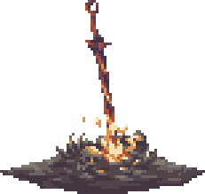

#   Roberto Blázquez Martín  

Soy Roberto Blázquez Martín, tengo 19 años y soy  Técnico en sistemas microinformáticos   y  Desarrollador muy junior de ASP NET CORE y NET CORE  

## Proyectos en los que estoy trabajando actualmente
- Bot de discord 

## Lenguajes que suelo usar

- C#
- Java
- GDscript
- Javascript
- CSS
- Html

## Actividad

## Contacto  

 

    
